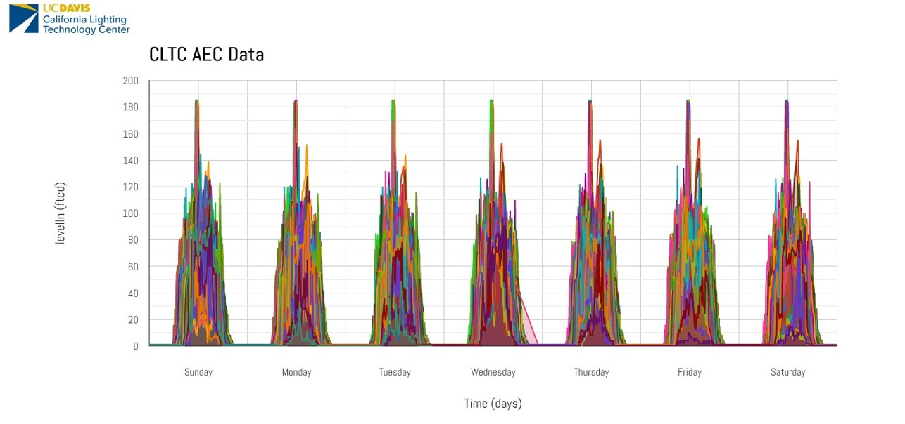

# CLTC AEC Data Aggregator 

## Summary
A static, purely front-end version of the data tool used by the CLTC to store and display chronological data collected over long periods of time.
This version has been implemented into Github pages for easy access without the need of setting up the Ruby on Rails backend.

This project was developed for use with an experiment at Sonoma Clean Power's Advanced Energy Center (AEC) with the intention of analyzing and comparing sensor readings to determine net energy savings produced by an IoT-integrated Solatube.

## How to use

Click the "browse.." button, select the .csv file you wish to upload, and then click "Upload CSV."

Each datatable is expected to be in a format where the first column holds the time (in ISO format) and each contiguous column holds a variable being recorded.

Once processed, the webtool allows for many helpful tools like averaging, comparing subsets of different variables against eachother, and exporting the shown data as both .csv (the table) and .svg (the graph) files. The data can also be "wrapped" along the horizontal axis, allowing for easy comparing of data across multiple days and weeks (useful for daylight-dependent measurements).